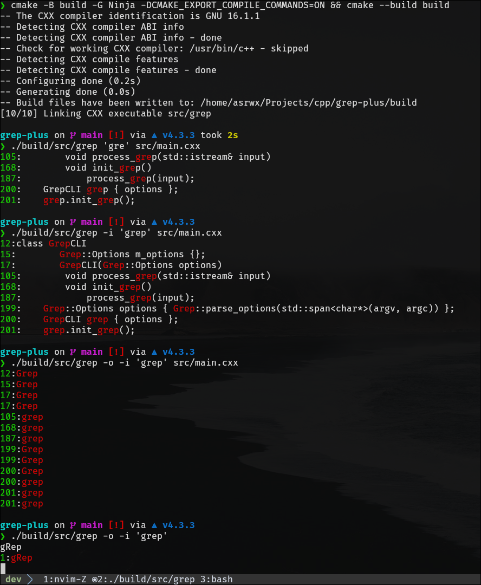

# Basic GNU grep clone written in C++.

## Supported features and functionalities:

- Case-insensitive pattern-matching using the `-i` flag.

- Print only the matched patterns using `-o` flag.

- Combination of `-i` and `-o` flags.

- If no file is given to grep from, read stdin by default.

- Print colored line numbers for getting the exact location of the pattern in the given input stream.

